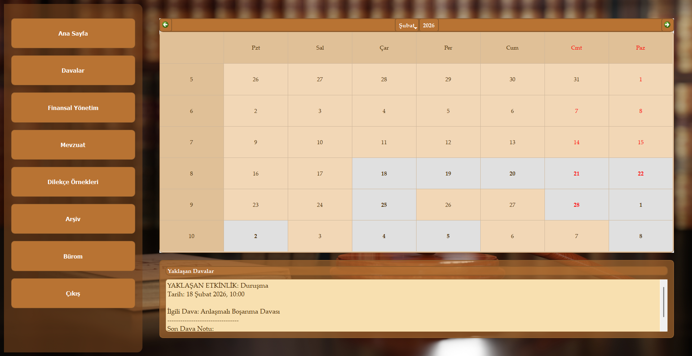
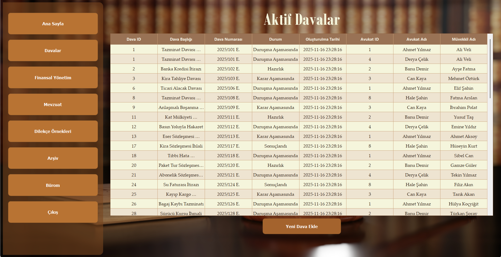
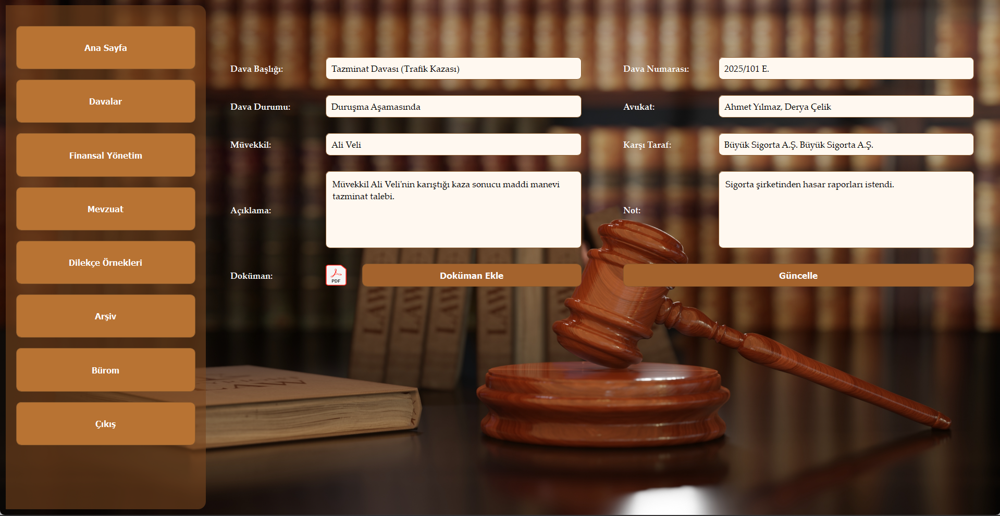
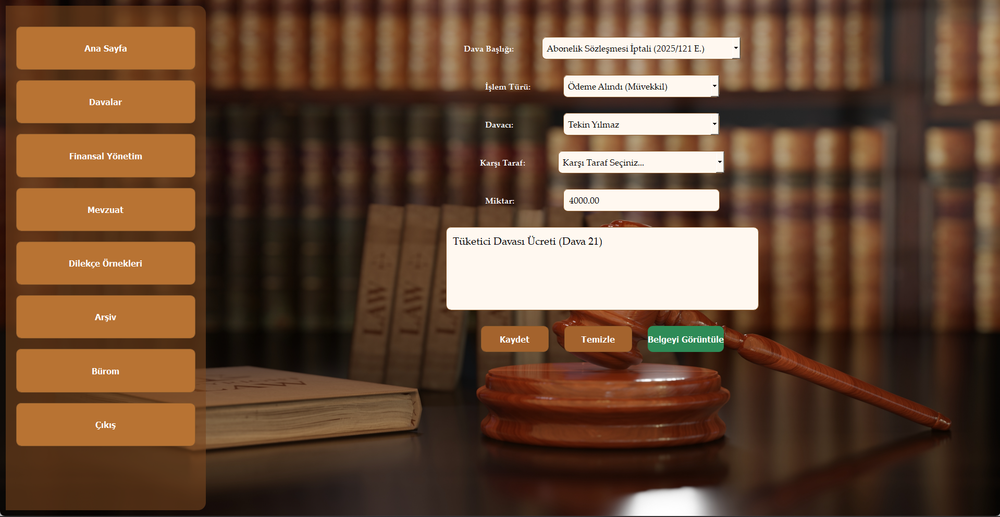
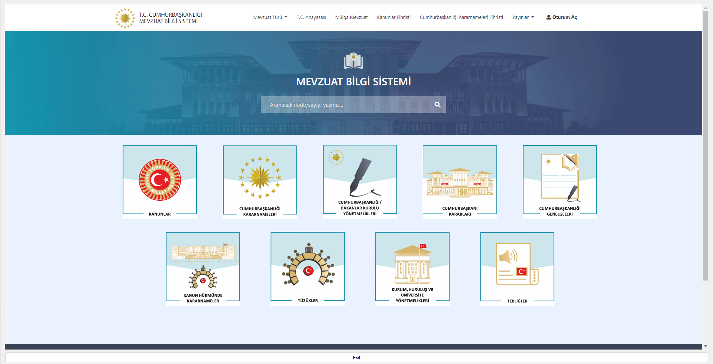
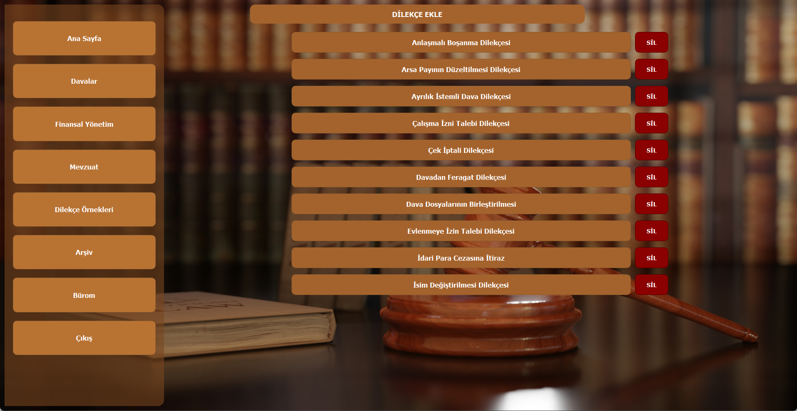
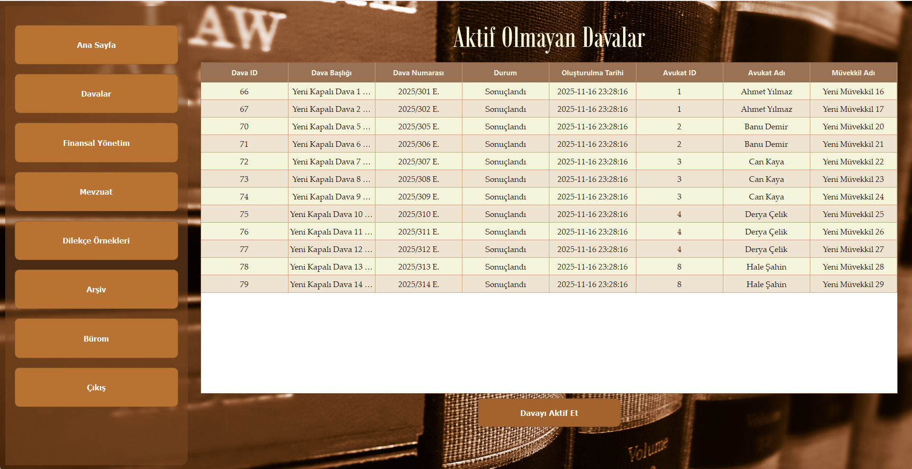
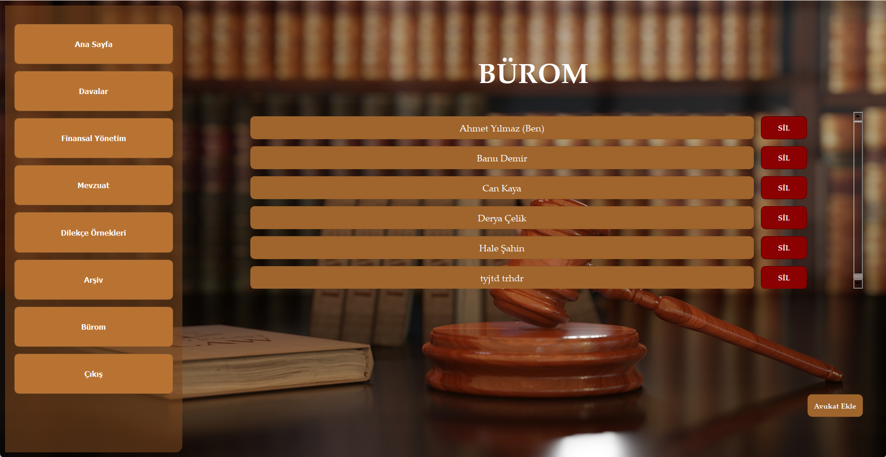

# Hukuk Bürom - Law Firm Management System

## About the Project
"Hukuk Bürom" is a comprehensive desktop application designed to digitalize, centralize, and automate the daily workflows of lawyers and law firms. It addresses the inefficiency of manual case tracking by bringing case management, financial records, calendars, and legal resources together under a single, secure platform.

The system provides tailored access based on user roles (Individual Lawyer and Bureau Manager), ensuring secure and efficient management of legal processes without data compromise.

## Key Features
* **Role-Based Access Control:** Distinct login gateways for individual lawyers (bar association ID) and bureau managers (firm credentials).
* **Interactive Calendar & Dashboard:** Automatically highlights critical case dates (hearings, site inspections) and displays upcoming priority events.
* **Case Management:** Create, update, and manage active cases. Track case details, client information, notes, and attached documents securely.
* **Archive System:** Securely store completed or inactive cases in an isolated archive, with the ability to reactivate them if necessary.
* **Financial Tracking:** Built-in tools to log and monitor case-specific income, expenses, and court fees, complete with document attachment capabilities for receipts.
* **Integrated Legal Resources:** Direct, in-app access to the official legislation system (mevzuat.gov.tr) and the UYAP Lawyer Portal to prevent workflow interruptions.
* **Petition Templates:** A dynamic library offering quick access to frequently used legal petition templates that can be downloaded as Word documents.

## Application Interfaces

### 1. Login & Registration
Users can securely log in or register based on their specific roles (Lawyer or Bureau Manager).

### 2. Main Dashboard
The central hub featuring an interactive calendar and an "Upcoming Event" tracker.

### 3. Case Management
The central table listing all ongoing processes, and the detailed view for individual case management.

### 4. Financial Management
The module where monetary transactions related to specific cases are recorded and managed.

### 5. Legal Resources & Petitions
In-app browser for legislation research and a downloadable template library for legal petitions.

### 6. Archive & Bureau Management
The archive for inactive cases and the managerial panel for overseeing affiliated lawyers.

## Installation and Setup
1. Clone the repository to your local machine.
2. Ensure you have Python installed along with the required libraries (e.g., `PyQt5`, `mysql-connector-python`, `python-dotenv`).
3. Create a `.env` file in the root directory based on the `.env.example` structure and configure your local database credentials.
4. Run `main.py` to start the application.

## Project Team
* Kanican Köseoğlu
* Enes Türkmenoğlu
* İbrahim Çobanköse
